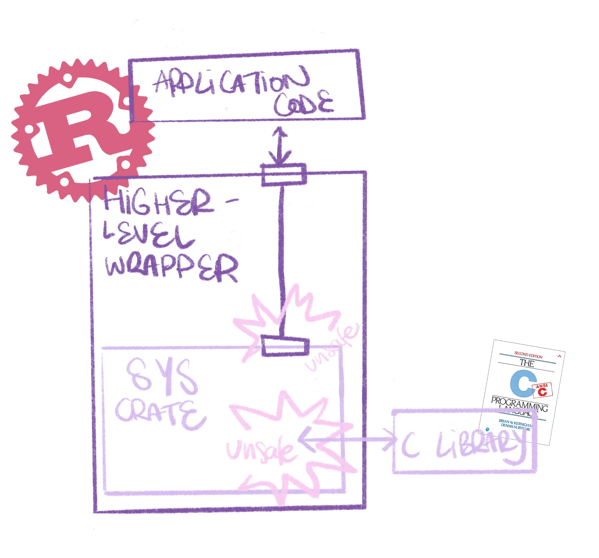

# FFI exercise: Binding to LevelDB

In this exercise your task is to create a Rust binding, or foreign function interface (FFI) to the [LevelDB] database library. Typically, and also in this exercise, "foreign" means "C".

You will learn how to:

- handle pointers passed to or from the foreign language
- use low-level C bindings
- utilize Rust's ownership system to provide safety on top of those raw primitives

[LevelDB]: (https://github.com/google/leveldb)

# Prerequisites

This exercise requires knowledge of a few Rust and C concepts:

- [Ownership & Borrowing](https://doc.rust-lang.org/1.49.0/book/ch04-00-understanding-ownership.html)
- [Lifetime annotations](https://doc.rust-lang.org/1.49.0/book/ch10-03-lifetime-syntax.html)
- [Traits](https://doc.rust-lang.org/1.49.0/book/ch10-02-traits.html)
- [Iterators](https://doc.rust-lang.org/1.49.0/book/ch13-02-iterators.html)
- [Casting](https://doc.rust-lang.org/rust-by-example/types/cast.html)
- [Error handling with `Result` and `Option`](https://doc.rust-lang.org/rust-by-example/error.html)
- [Unsafe Rust](https://doc.rust-lang.org/1.49.0/book/ch19-01-unsafe-rust.html) and raw pointers
- C strings represented as null-terminated chunks of 8-bit `char`s
- using C pointers as function parameters for returning multiple results in one call

Conceptually, LevelDB is a [key-value store](https://en.wikipedia.org/wiki/Key%E2%80%93value_database), AKA a persistent dictionary or map.

## Mental exercise: Ownership in C
How is ownership handled in C?
<details>
  <summary>Hint</summary>
  When does a "double free" occur?
</details>
<details>
  <summary>Solution</summary>
  Ownership is handled only informally - typically an API's documentation and/or function names (e.g. "create", "new") will indicate whether you are responsible to free up the memory passed to you, or it is somebody else's problem. Unclear ownership (via multiple mutable pointers to the same memory), API misunderstandings or other kinds of human error can easily lead to memory being freed too often or too little, resulting in crashes or leaks. 
</details>


# Setup
## Required dependencies
Binding to C is divided into two parts: a minimal low-level interface, a so-called "sys crate" and a higher level wrapper crate.



The sys crate is responsible for linking to the C library and exposing its contents unchanged.

The higher level crate uses the sys crate to provide a more Rust-friendly interface by safely wrapping the inherently `unsafe` raw parts.

Writing a sys crate yourself is beyond the scope of this exercise. We will be using the [`leveldb` crate provided for you](https://docs.rs/leveldb-sys/2.0.8/leveldb_sys/).
You will need to specify it on the `Cargo.toml`'s `[dependencies]` section. You'll also need the [`libc`](https://docs.rs/libc/0.2.97/libc/) crate which provides C types and other required definitions:

```diff
# in Cargo.toml

[dependencies]
+leveldb-sys = "*"
+libc = "*"
```

<details>
  <summary>❗ Note on specifying dependencies using the asterisk</summary>
  Declaring a dependency as <span style="font-family: sans-serif">*</span> ("any version") is generally not recommended - we're doing it here to prevent stale version numbers and assume it's safe because these specific crates are very unlikely to introduce breaking changes. An alternative would be to install <a href="https://crates.io/crates/cargo-edit">cargo-edit</a> and then use the contained <span style="font-family: sans-serif">cargo-add</span> command to add a dependency on the most recent release version:
<pre>
$ cargo add leveldb-sys
$ cargo add libc
</pre>
</details>

Building `leveldb-sys` requires [CMake](https://cmake.org/) and a C++ compiler (gcc, clang, Visual Studio etc.) to be installed on your system.

> 🔎 Should you ever need to write your own sys crate you can find instructions for doing so [here](https://kornel.ski/rust-sys-crate).

# Exercise: Opening and closing a database
## Preparation
Conceptually, a LevelDB database is a directory (the "database name") where all its required files are stored. "Opening" it means passing a path (whose last part is the database name) and some options to `leveldb_open`, notably `create_if_missing`, which will create the database directory in case it does not exist.

You'll also need these functions and enums from the `leveldb-sys` crate:

* [`leveldb_t`](https://docs.rs/leveldb-sys/2.0.8/leveldb_sys/enum.leveldb_t.html): opaque handle representing an opened database. The handle is thread-safe.
* [`leveldb_open`](https://docs.rs/leveldb-sys/2.0.8/leveldb_sys/fn.leveldb_open.html): opens a database, returning `leveldb_t`
* [`leveldb_close`](https://docs.rs/leveldb-sys/2.0.8/leveldb_sys/fn.leveldb_close.html): closes a `leveldb_t` for a clean shutdown
* [`leveldb_options_t`](https://docs.rs/leveldb-sys/2.0.8/leveldb_sys/enum.leveldb_options_t.html): opaque handle representing database options
* [`leveldb_options_create`](https://docs.rs/leveldb-sys/2.0.8/leveldb_sys/fn.leveldb_options_create.html): create an instance of this options struct
* [`leveldb_options_destroy`](https://docs.rs/leveldb-sys/2.0.8/leveldb_sys/fn.leveldb_options_destroy.html): deallocates `leveldb_options_t`
* [`leveldb_options_set_create_if_missing`](https://docs.rs/leveldb-sys/2.0.8/leveldb_sys/fn.leveldb_options_set_create_if_missing.html): sets the `create_if_missing` flag on `leveldb_options_t`.

The [LevelDB C header](https://github.com/google/leveldb/blob/master/include/leveldb/c.h) documents some conventions used by its implementation. 


## Your tasks
If you're stuck, check out the [Help and hints](#help-and-hints) below!

✅ Create a new library package project for this group of exercises. Add the required dependencies.

✅ Implement functions for:
- opening a database, forwarding the "create if missing" flag
- closing it again

✅ Refactor your code and create wrapping structs for the raw `leveldb_t` and `leveldb_options_t` types, taking care of the required cleanup operations.
- It should not be possible to forget the cleanup.
- The struct member storing the pointer should use an appropriate Rust type to express the fact that it exclusively stores non-`null` pointers.

✅ Create a `Database` struct that manages high-level operations. 

## Polishing your solution

How's your error handling? `open` should not panic - return a custom error instead. To keep things concise, make use of the [question mark operator] (see also [the following section] on using it in tests). Convert errors where necessary.

[question mark operator]: https://doc.rust-lang.org/edition-guide/rust-2018/error-handling-and-panics/the-question-mark-operator-for-easier-error-handling.html
[the following section]: https://doc.rust-lang.org/edition-guide/rust-2018/error-handling-and-panics/question-mark-in-main-and-tests.html

✅ Test the success and error cases.

✅ What type(s) does your `open` function accept as database names? What would offer the most flexibility? Get some inspiration from [std::fs::File](https://doc.rust-lang.org/std/fs/struct.File.html).
✅ Include the underlying LevelDB error message string in your error type. Mind the ownership!
✅ Rust Strings are valid UTF-8. What issues might occur
- as opposed to C strings?
- regarding valid file system characters? (a LevelDB database is a directory!)

---

The most straightforward parameter type for the database name is `&str` ([why not `String`?](https://www.ameyalokare.com/rust/2017/10/12/rust-str-vs-String.html)). Since we're dealing with paths, what would be an alternative that still has the convenience of using string literals on the caller side?

✅ Change your function signature accordingly.
<details>
  <summary>Hint</summary>
  Which trait bounding provides the required functionality?
</details>

## Help and hints

- Getting mysterious crashes? Are you maybe dereferencing an uninitialized raw pointer?
- `c_uchar` is an alias for `u8`, and Rust booleans are [safe to cast](https://doc.rust-lang.org/reference/types/boolean.html) `as u8`.
- You need to pass an error pointer to `open`. The C library potentially mutates it, and initially it should point to `null`. For creating a suitable pointer Rust provides you with [`std::ptr::null_mut`](https://doc.rust-lang.org/std/ptr/fn.null_mut.html).
- A null pointer is equal (`==`) to any other null pointer. Raw pointers also offer [is_null()](https://doc.rust-lang.org/std/primitive.pointer.html#method.is_null) for checking.
- If an error occurs you *own* the C string containing the error message. You can either free it or reuse it for future calls - which option is more convenient?
- When `open` succeeds, it gives you a *valid, non-null* pointer back. A natural mapping for this type is [`NonNull::new_unchecked`](https://doc.rust-lang.org/std/ptr/struct.NonNull.html#method.new_unchecked).
- Owned C strings can be created with [`std::ffi::CString`](https://doc.rust-lang.org/std/ffi/struct.CString.html). Note that unlike C strings, Rust strings can contain null bytes.
- To handle paths there's [`std::path::Path`](https://doc.rust-lang.org/std/path/struct.Path.html). For simplicity reasons, assume paths are valid UTF-8, which in the real world isn't always the case. 
- Errors can be converted with [`map_err` and `From::from`](https://doc.rust-lang.org/rust-by-example/error/multiple_error_types/reenter_question_mark.html).
- String types implement <a href="https://doc.rust-lang.org/std/convert/trait.AsRef.html">AsRef&lt;Path&gt;</a>, which makes it a good fit for path parameters.


### Testing
LevelDB, being a database, persists data to disk. When writing tests for your binding, creating this data in a temporary fashion is appropriate, saving you from doing cleanup work yourself. The [tempdir](https://docs.rs/tempdir/0.3.7/tempdir/) crate provides this functionality, but if you added it to `[dependencies]` it would also be installed for every user of your library, even if they didn't intend to run your tests. Fortunately, Cargo has a `[dev-dependencies]` section for crates that are only required during development:
```
[dev-dependencies]
tempdir = "*"
```

### Basic template
You can use this code skeleton to get started:

```rust
use leveldb_sys::*;
use std::ptr;
use std::ffi::CString;

fn main() {
    let options = unsafe { leveldb_options_create() };

    unsafe { leveldb_options_set_create_if_missing(options, true as u8) };

    let mut err = ptr::null_mut();

    let name = CString::new("my_db").unwrap();

    let (db_ptr, err_ptr) = unsafe {
        let db_ptr = leveldb_open(
            options,
            name.as_ptr(),
            &mut err,
        );

        (db_ptr, err)
    };

    unsafe { leveldb_options_destroy(options) };

    if err_ptr == ptr::null_mut() {
        unsafe { leveldb_close(db_ptr) }
    } else {
        unsafe {
            println!("Error opening database: {}", *err_ptr);
        }
    }
}
```
